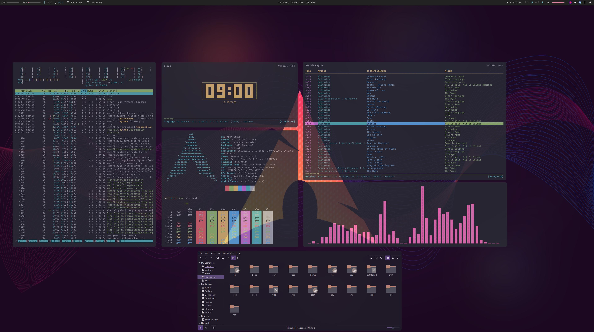

# Dotfiles - XMonad (Arch)

### OS - Arch

### WM - XMonad

### Bar - Polybar

### Music - Mopidy/ncmcpp

### Compositor - Picom

### GTK - Rosepine

### Icons - Zafiro Dark Red

### Shell - Zsh

### Notifications - Dunst

### Terminal - Alacritty

### Menu - Rofi (Theme - KDE Runner)
